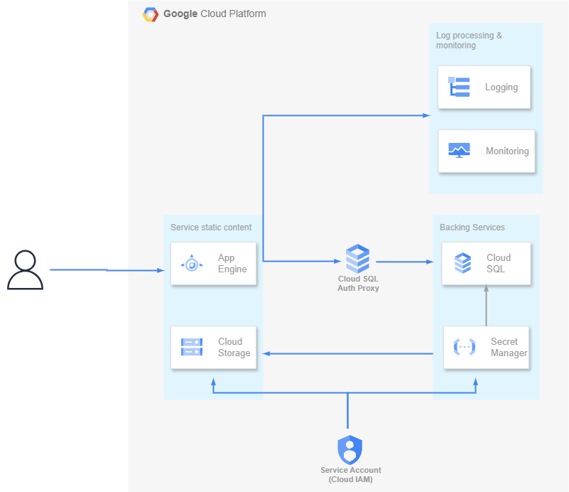

# Deploy Application to Google App Engine (Google Cloud)

## Acknowledgements

1. Deploy application in `Google App Engine`

2. Create and configure a PostgreSQL instance on `Cloud SQL`.

3. Employ `Secret Manager` for managing environment variables and sensitive data.

4. Configure `Cloud Storage` for the preservation of static and media files.

5. Scan application security vulnerabilities using `Security Scans`.

6. Set up `App Engine firewall rules` for Application.

## Operating system

I used `Ubuntu 2022.04.3`

## Run Django Application

1. Clone Django project

2. Create and activate a virtual environment:

    ```sh
    $ python3 -m venv venv && source venv/bin/activate
    ```

3. Install the requirements:

    ```sh
    (venv)$ pip install -r requirements.txt
    ```

4. Apply the migrations:

    ```sh
    (venv)$ python manage.py migrate
    ```

5. Run the server:

   ```sh
    (venv)$ python manage.py runserver
    ```

 6. Navigate to [http://localhost:8000/](http://localhost:8000/) in web browser.

## Google App Engine Architecture Diagram


Designed by [Phuong Linh](https://github.com/ptpl2602)

## My Demo - Deploy application

1. [Full version demo](https://drive.google.com/file/d/1XPSelk2VsdQ3uyk4D1B5ORSNQDvIJUJr/view?usp=sharing)

3. [Results demo (without installation process)](https://drive.google.com/file/d/1rRK3a8bwlTIZLxiO2zxNOHEhgSG9-Bwy/view?usp=sharing)

